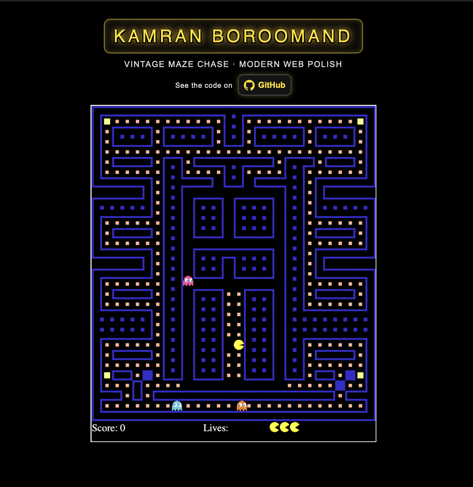

# PacMan 🟡👻

An in-browser, canvas-based homage to the classic Pac-Man arcade game. This project runs entirely on static assets (HTML/CSS/JS) and is designed to fit any screen while keeping the pixel-art vibe intact. 🎮

## Preview 👀

## What’s inside 📂

- **index.html** – Minimal shell that loads the canvas, sprites, and scripts.  
- **css/style.css** – Retro-inspired styling for the page header and overall layout.  
- **scripts/game.js** – Game loop, rendering, responsive canvas scaling, map data, spawn logic, and HUD.  
- **scripts/pacman.js** – Pac-Man movement, collision handling, and pellet consumption logic.  
- **scripts/ghost.js** – Ghost AI, pathfinding, animation, and rendering.  
- **images/** – Sprite sheets for Pac-Man and ghosts, plus favicon and preview assets.  

## Gameplay details 🕹️

- Authentic **28×31 maze** with pellets and four corner power pellets.  
- **Responsive canvas**: Scales to your viewport while keeping crisp pixels.  
- **Randomized ghost spawns** on safe walkable tiles each game; Pac-Man spawns in the classic start lane.  
- **Power pellets** are rendered larger, award bonus points, and are tracked separately from normal pellets.  

## Idea behind it 💡

This subdomain exists purely for nostalgia: to host a faithful Pac-Man experience on the web, mixing old-school visuals with modern responsiveness. It’s a lightweight showcase of how far you can go with only **HTML5 canvas** and **vanilla JavaScript**. 🕹️

## Running locally 💻

No build step is required. Simply serve the root folder with any static server (or open `index.html` directly), ensure `scripts/` and `images/` remain in place, and start playing! 🎮

## Contribution 🤝

Issues and PRs are welcome! If you add features (like frightened ghost mode or sound), please keep the footprint small and the retro feel intact. 🎶
