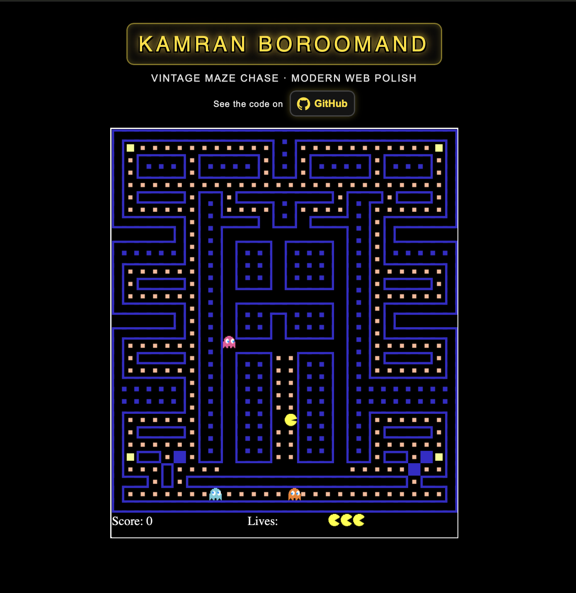

# PacMan
A fully static, retro-style Pac-Man browser game with responsive canvas rendering and mobile-friendly controls.

## Table of Contents
- [Overview](#overview)
- [Core Features](#core-features)
- [Tech Stack](#tech-stack)
- [Architecture](#architecture)
- [Quick Start](#quick-start)
- [Configuration](#configuration)
- [Scripts](#scripts)
- [Deployment](#deployment)
- [Security/Quality Notes](#securityquality-notes)
- [Roadmap](#roadmap)

## Overview
This repository contains a classic Pac-Man style game implemented with plain HTML, CSS, and JavaScript.

- No build system or backend is required.
- The game runs entirely in the browser via a `<canvas>`.
- Gameplay includes pellets, power pellets, ghosts, score/lives HUD, and level/game-over reset behavior.
- Desktop and mobile input are both supported (keyboard, touch buttons, and swipe).



## Core Features
- Classic maze layout (`28 x 31` tiles) with walls, pellets, and corner power pellets.
- Responsive canvas scaling with device-pixel-ratio support for crisp rendering.
- Pac-Man movement with wall collision checks and tunnel wrap logic.
- Ghost AI with pathfinding toward Pac-Man when in range and random-corner targeting otherwise.
- Fruit spawn system with timed visibility, score bonus, and temporary invincibility.
- Chain ghost-eat scoring while invincibility is active.
- On-screen touch controls plus swipe gestures for mobile gameplay.

## Tech Stack
- HTML5
- CSS3
- Vanilla JavaScript (ES6+)
- HTML5 Canvas API
- Static asset deployment (GitHub Pages-compatible)

## Architecture
### Key Files
- `index.html`: Page shell, canvas, sprite assets, and script loading.
- `css/style.css`: Retro UI styling, responsive layout, and touch-control presentation.
- `scripts/game.js`: Global game state, map data, game loop, rendering pipeline, spawns, controls, and lifecycle.
- `scripts/pacman.js`: `Pacman` class (movement, collision, direction change, pellet consumption, draw logic).
- `scripts/ghost.js`: `Ghost` class (pathfinding/chase behavior, movement, draw logic).

### Runtime Flow
1. `game.js` initializes map state, Pac-Man, ghosts, fruit timers, and starts the interval loop.
2. Each frame runs `update()` then `draw()`.
3. `update()` applies movement, collision resolution, food/fruit consumption, ghost interaction, and win/lose checks.
4. `draw()` renders walls, pellets, fruit, ghosts, Pac-Man, score, lives, and power-mode timer.

## Quick Start
### Option A: Open Directly
1. Clone this repository.
2. Open `index.html` in a modern browser.

### Option B: Serve Locally (recommended)
```bash
git clone https://github.com/KamranBoroomand/PacMan.git
cd PacMan
python3 -m http.server 8080
```

Then open `http://localhost:8080`.

## Configuration
Primary gameplay/config constants live in `scripts/game.js`.

| Constant | Default | Purpose |
| --- | --- | --- |
| `fps` | `30` | Main game loop update/render frequency. |
| `oneBlockSize` | `20` | Tile size used by movement, collision, and rendering. |
| `ghostCount` | `4` | Number of ghosts spawned each round. |
| `lives` | `3` | Starting lives per run. |
| `FRUIT_SPAWN_DELAY_MS` | `12000` | Delay before fruit appears. |
| `FRUIT_VISIBLE_MS` | `10000` | How long fruit stays visible. |
| `FRUIT_INVINCIBILITY_MS` | `8000` | Invincibility duration after fruit pickup. |
| `FRUIT_SCORE` | `50` | Score gained when fruit is collected. |
| `GHOST_EAT_BASE_SCORE` | `20` | Base score multiplier when eating ghosts during power mode. |
| `MIN_FRUIT_SPAWN_DISTANCE` | `8` | Minimum tile distance between Pac-Man and spawned fruit. |
| `MIN_GHOST_RESPAWN_DISTANCE` | `10` | Minimum distance for ghost respawn after being eaten. |
| `MIN_GHOST_INITIAL_SPAWN_DISTANCE` | `7` | Minimum initial ghost spawn distance from Pac-Man. |
| `SWIPE_THRESHOLD_PX` | `24` | Minimum swipe distance to trigger mobile direction change. |

## Scripts
There is no `package.json` script runner in this repository.

Application source scripts:
- `scripts/game.js` (orchestration/game loop/input/rendering/state)
- `scripts/pacman.js` (player logic)
- `scripts/ghost.js` (enemy logic/pathfinding)

## Deployment
This project is static and can be deployed to any static host.

Current production domain is configured via `CNAME`:
- `pacman.kamranboroomand.ir`

Typical GitHub Pages flow:
1. Push repository changes to the branch configured for Pages.
2. Ensure root files (`index.html`, `css/`, `scripts/`, `images/`) are published.
3. Keep `CNAME` in the deployed root to retain custom-domain routing.

## Security/Quality Notes
- No backend or persistent storage is used; all state is in-memory on the client.
- No authentication or user data processing is present in this codebase.
- Client-side score/state can be modified by end users (expected for arcade-style browser games).
- Dependencies are minimal (Google Fonts import only); no npm supply-chain surface here.
- License: MIT (`LICENSE`).

## Roadmap
- Add frightened-mode ghost visuals/behavior to better mirror arcade rules.
- Add audio effects and optional mute toggle.
- Add pause/resume and restart UI controls (in-canvas or header controls).
- Add local high-score persistence (e.g., `localStorage`).
- Add automated linting/tests and CI checks for gameplay regressions.
