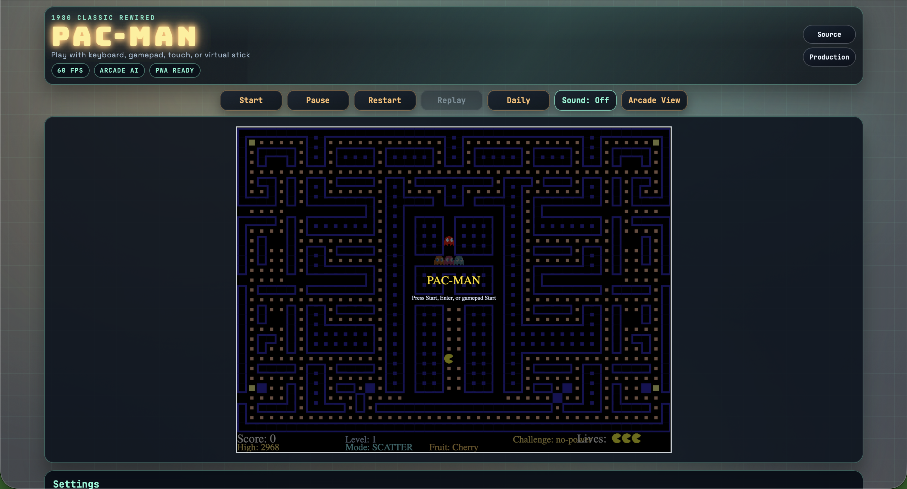
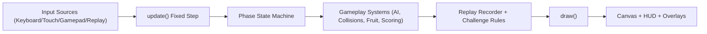

# PacMan
A fully static, retro-style Pac-Man browser game with responsive canvas rendering and mobile-friendly controls.

## Table of Contents
- [Overview](#overview)
- [Core Features](#core-features)
- [Tech Stack](#tech-stack)
- [Architecture](#architecture)
- [Quick Start](#quick-start)
- [Configuration](#configuration)
- [Scripts](#scripts)
- [Contributor Testing Guide](#contributor-testing-guide)
- [Deployment](#deployment)
- [Security/Quality Notes](#securityquality-notes)
- [Roadmap](#roadmap)

## Overview
This repository contains a classic Pac-Man style game implemented with plain HTML, CSS, and JavaScript.

- No build system or backend is required.
- The game runs entirely in the browser via a `<canvas>`.
- Gameplay includes arcade-style ghost personalities, Cruise Elroy phases, per-level scatter/chase parity tables, challenge modes, replay playback, and cutscene transitions.
- Desktop and mobile input are both supported (keyboard rebinding, touch buttons, virtual stick, and gamepad support).



## Core Features
- Classic maze layout (`44 x 31` tiles) with walls, pellets, power pellets, and side-wrap tunnels.
- Responsive canvas scaling with device-pixel-ratio support for crisp rendering.
- Pac-Man movement with wall collision checks and tunnel wrap logic.
- Arcade-accurate ghost behavior with per-ghost targeting logic:
  - Blinky (direct chase), Pinky (ambush ahead), Inky (vector-based), Clyde (distance-based scatter/chase).
- Scatter/chase cycle schedule with frightened overrides and ghost-house release rules.
- Level progression with per-level speed/difficulty tuning, fruit table scoring, and bonus-life milestones.
- Full round-state flow: start screen, ready phase, death phase, intermission, and game-over state.
- Attract mode: automatic demo playback starts after start-screen idle timeout.
- Classic-style level cutscenes with Start-key skip support.
- HUD upgrades: level indicator, ghost mode indicator, fruit label, ghost-eat point popups, and overlay improvements.
- Configurable settings panel with:
  - Volume control, mute, key rebinding, challenge mode select, and mobile input mode selection.
  - Accessibility controls: color-blind/high-contrast palette, reduced motion, and large HUD text.
  - Persistent settings via `localStorage`.
- Replay system:
  - Deterministic run seed + per-frame action capture.
  - Replay button to rerun the last completed attempt.
  - Export/import replay JSON plus shareable URL hash links.
- Deterministic simulation debugger:
  - Seed inspector with apply/copy controls.
  - Pause/step frame controls for deterministic debugging.
- Challenge modes:
  - Classic, Time Attack, No Power Pellets, and One Life.
- Daily challenge mode with date-based seed, local history, and streak tracking.
- Local leaderboard by mode+seed with best score and best run time.
- Expanded input support:
  - Keyboard, touch buttons, swipe, virtual stick, and gamepad.
  - Remappable gamepad action buttons and one-handed accessibility mode.
- Mobile UX upgrades:
  - Adaptive control sizing, orientation-aware layout tuning, and optional haptic feedback.
- Runtime/performance updates:
  - `requestAnimationFrame` game loop targeting smooth 60 FPS.
  - Cached wall tiles and reduced per-frame overhead in hot paths.
- Audio polish:
  - Per-channel mixer controls (master/SFX/music), looped synth bed, and SFX-driven ducking.
- PWA support:
  - Installable app via `manifest.webmanifest`.
  - Offline caching with versioned static/runtime caches.
  - In-app update-ready prompt wired to `skipWaiting`.
- CI/release upgrades:
  - Unit + e2e test workflows.
  - Optional visual snapshot Playwright specs.
  - Visual regression lane + flaky-test quarantine workflow.
  - Deployable site artifact workflow.
  - Manual release tagging with semantic-version validation, alpha/stable channels, categorized changelog, and rollback guide.

## Tech Stack
- HTML5
- CSS3
- Vanilla JavaScript (ES6+)
- HTML5 Canvas API
- Static asset deployment (GitHub Pages-compatible)

## Architecture
### Key Files
- `index.html`: Page shell, canvas, sprite assets, and script loading.
- `css/style.css`: Retro UI styling, responsive layout, and touch-control presentation.
- `scripts/game.js`: Global game state, level progression, ghost AI orchestration, round phases, controls, settings, audio, PWA hooks, and rendering loop.
- `scripts/gameplay-utils.js`: Shared gameplay helpers (AI targeting math, collision helpers, level tuning, scoring, and state utilities).
- `scripts/pacman.js`: `Pacman` class (movement, collision, direction change, pellet consumption, draw logic).
- `scripts/ghost.js`: `Ghost` class (personality-driven target selection, house-release lifecycle, chase/scatter/frightened/eaten states, movement, draw logic).
- `scripts/lint.js`: Built-in lint checks (syntax + structural gameplay checks).
- `tests/*.test.js`: Node-based unit/regression tests for gameplay utilities and structure.
- `tests/e2e/*.spec.js`: Playwright browser regression tests.
- `playwright.config.js`: Playwright config with local static web server.
- `.github/workflows/ci.yml`: Lint + unit tests on push/PR.
- `.github/workflows/quality-checks.yml`: Lint/unit/e2e checks + upload site artifact.
- `.github/workflows/release.yml`: Manual tag + changelog + GitHub release workflow.

### Runtime Flow
1. `game.js` initializes map state, actors, level tuning, replay seed, and UI handlers.
2. Each animation frame advances a fixed-step simulation (`update`) then renders (`draw`).
3. `update` runs input (keyboard/touch/gamepad/replay), phase transitions, challenge timers, AI mode updates, collisions, and scoring.
4. `draw` renders map layers, entities, HUD, popups, cutscenes, and overlays.


```mermaid
flowchart LR
  A["Input Sources (Keyboard/Touch/Gamepad/Replay)"] --> B["update() Fixed Step"]
  B --> C["Phase State Machine"]
  C --> D["Gameplay Systems (AI, Collisions, Fruit, Scoring)"]
  D --> E["Replay Recorder + Challenge Rules"]
  E --> F["draw()"]
  F --> G["Canvas + HUD + Overlays"]
```

## Quick Start
### Option A: Open Directly
1. Clone this repository.
2. Open `index.html` in a modern browser.

### Option B: Serve Locally (recommended)
```bash
git clone https://github.com/KamranBoroomand/PacMan.git
cd PacMan
python3 -m http.server 8080
```

Then open `http://localhost:8080`.

## Configuration
Primary gameplay/config constants live in `scripts/game.js`.

| Constant | Default | Purpose |
| --- | --- | --- |
| `fps` | `60` | Main game loop update/render frequency (fixed-step updates via `requestAnimationFrame`). |
| `oneBlockSize` | `20` | Tile size used by movement, collision, and rendering. |
| `lives` | `3` | Starting lives per run. |
| `ROUND_READY_MS` | `1800` | “Ready!” phase duration before active movement. |
| `INTERMISSION_MS` | `1500` | Stage-clear intermission duration. |
| `BONUS_LIFE_STEP` | `10000` | Score interval for bonus lives (`1UP`). |
| `GHOST_MODE_SCHEDULE` | Classic schedule | Scatter/chase timing cycle for ghost AI. |
| `FRUIT_TABLE` | 8 classic fruits | Per-level fruit score table. |
| `MIN_FRUIT_SPAWN_DISTANCE` | `8` | Minimum tile distance between Pac-Man and spawned fruit. |
| `MIN_GHOST_INITIAL_SPAWN_DISTANCE` | `7` | Minimum initial ghost spawn distance from Pac-Man. |
| `SWIPE_THRESHOLD_PX` | `24` | Minimum swipe distance to trigger mobile direction change. |
| `SETTINGS_STORAGE_KEY` | `pacman.settings.v1` | Local persistence key for settings. |
| `HIGH_SCORE_STORAGE_KEY` | `pacman.highScore` | Local persistence key for high score. |

## Scripts
Quality scripts are available through `npm`:

```bash
npm run lint
npm test
npm run test:e2e
npm run test:e2e:visual
npm run check
npm run check:all
PLAYWRIGHT_VISUAL=1 npm run test:e2e
```

- `npm run lint`: Syntax + structural lint checks (`scripts/lint.js`).
- `npm test` / `npm run test:unit`: Unit/regression tests (`tests/*.test.js`) using Node's built-in test runner.
- `npm run test:e2e`: Browser end-to-end tests with Playwright (`tests/e2e/*.spec.js`).
- `npm run test:e2e:visual`: Runs Playwright with `PLAYWRIGHT_VISUAL=1` for snapshot checks.
- `PLAYWRIGHT_VISUAL=1 npm run test:e2e`: Enables visual snapshot assertions in `tests/e2e/visual.spec.js`.
- `npm run check`: Runs lint + unit tests.
- `npm run check:all`: Runs lint + unit + e2e tests.

## Contributor Testing Guide
1. Run fast checks before every commit:
   ```bash
   npm run check
   ```
2. Run browser regression checks before opening a PR:
   ```bash
   npm run test:e2e
   ```
3. Run visual snapshot checks when UI/animation/HUD changes:
   ```bash
   PLAYWRIGHT_VISUAL=1 npm run test:e2e
   ```
4. If visual tests fail after intentional UI change, update snapshots with:
   ```bash
   PLAYWRIGHT_VISUAL=1 npx playwright test --update-snapshots
   ```
5. Validate release readiness locally:
   ```bash
   npm run check
   ```

## Deployment
This project is static and can be deployed to any static host.

Current production domain is configured via `CNAME`:
- `pacman.kamranboroomand.ir`

Typical GitHub Pages flow:
1. Push repository changes to the branch configured for Pages.
2. Ensure root files (`index.html`, `css/`, `scripts/`, `images/`) are published.
3. Keep `CNAME` in the deployed root to retain custom-domain routing.

## Security/Quality Notes
- No backend is used; gameplay runs fully on the client.
- No authentication or user data processing is present in this codebase.
- Client-side score/state can be modified by end users (expected for arcade-style browser games).
- High scores are stored locally in the browser via `localStorage` (`pacman.highScore`).
- User settings are stored locally in the browser via `localStorage` (`pacman.settings.v1`).
- App can be installed and played offline using service-worker caching.
- Tooling uses Node.js plus Playwright for browser regression testing.
- License: MIT (`LICENSE`).

## Roadmap
- [x] Arcade-accurate ghost AI (Blinky/Pinky/Inky/Clyde), scatter/chase cycles, and ghost-house release rules.
- [x] Level progression with speed/difficulty scaling, fruit tables, and bonus-life milestones.
- [x] Start/round flow polish with start screen, ready phase, life-loss animation, and intermission transitions.
- [x] HUD/feedback upgrades with ghost-eat point popups, level indicator, and improved overlays.
- [x] Settings panel with volume, key rebinding, and local persistence.
- [x] Input expansion with gamepad support and virtual-stick mobile mode.
- [x] Stronger regression protection with gameplay unit tests and Playwright e2e tests.
- [x] Performance/compatibility pass with 60 FPS loop and hot-path optimizations.
- [x] PWA/offline packaging with manifest + service worker.
- [x] Release workflow polish with quality checks and automated tag/changelog release flow.
- [x] Arcade-parity deepening with Cruise Elroy phases, per-level mode schedules, and frightened-turn limits.
- [x] Idle attract mode with demo playback.
- [x] Intermission cutscenes with skip support.
- [x] Challenge modes: time attack, no-power-pellet, and one-life run.
- [x] Replay system with deterministic seed + recorded input playback.
- [x] Accessibility pass with palette options, reduced motion, and larger HUD text.
- [x] Expanded regression coverage with deterministic utility tests and optional Playwright visual snapshots.
- [x] PWA update UX with cache versioning and install/update analytics hooks.
- [x] Release hardening with semantic version validation and categorized changelog generation.
- [x] Documentation refresh with architecture flow and contributor testing guide.
- [x] Full deterministic simulation mode with single-step debugger and seed inspector.
- [x] Replay v2 with replay export/import and shareable replay links.
- [x] Daily seeded challenge flow with local history and streak tracking.
- [x] Local leaderboard per mode/seed with best score and best-time tracking.
- [x] AI parity harness with deterministic golden-path ghost movement snapshots.
- [x] Audio polish pass with channel mixer controls, music layer, and ducking.
- [x] Accessibility expansion with remappable gamepad actions, high-visibility palettes, and one-handed mode.
- [x] Mobile UX pass with adaptive control sizing, haptics hooks, and orientation-aware layout.
- [x] CI hardening with visual regression lane and flaky quarantine workflow.
- [x] Release/channel flow with alpha/stable channel input and rollback guidance.
